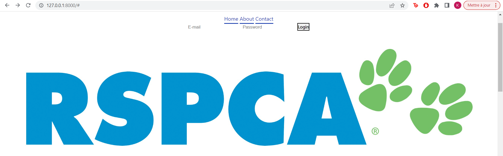
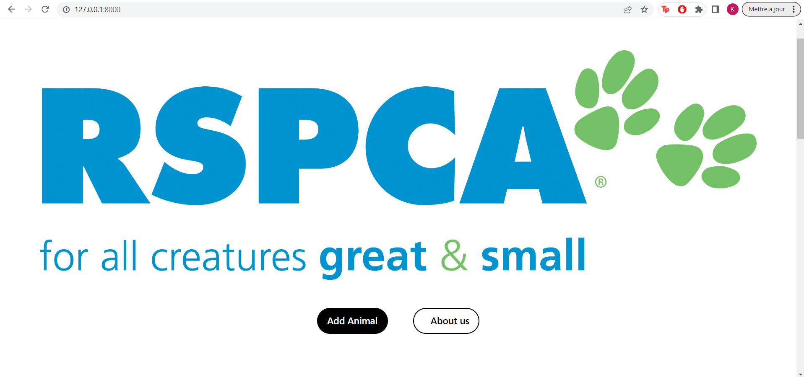
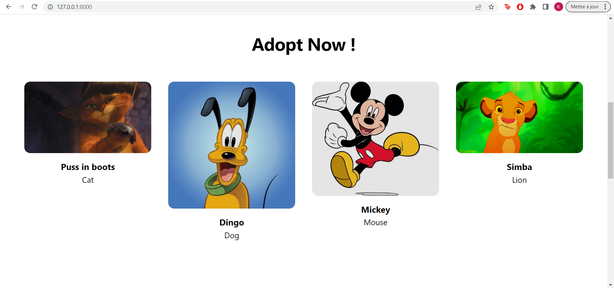

# MyRSPCA
MyRSPCA is a CRUD Django project that enables different RSPCAs to create accounts and add the animals they rescued to the server, so that people can adopt them. The project uses MySQL as the database management system.

## Requirements
Python 3.6 or higher
Django 3.1.7 or higher
MySQL server 5.7 or higher

## Installation

1. Clone the repository to your local machine.
```shell
git clone https://github.com/milik0/RSPCA-server.git
```

2. Create a virtual environment and activate it.
```shell
python3 -m venv env
source env/bin/activate
```

3. Install the required packages.
```shell
pip install -r requirements.txt
```

4. Create a MySQL database for the project.
```shell
mysql -u root -p
create database myrspca
```

5. Set up the database settings in settings.py.

```python
DATABASES = {
    'default': {
        'ENGINE': 'django.db.backends.mysql',
        'NAME': 'myrspca',
        'USER': 'root',
        'PASSWORD': 'your_mysql_password',
        'HOST': 'localhost',
        'PORT': '3306',
    }
}
```

6. Migrate the database.
```shell
python3 manage.py migrate
```

7. Run the server.
```shell
python3 manage.py runserver
```

## Usage
- Open your web browser and go to http://localhost:8000/.

- You can create accounts and log in the authentification page or thanks to the following nav-bar.


- A reset password feature is available in case you forgot your password.

- Once signed up or logged in you will find the following web page.


- You can add the animals that you rescued by clicking on the "Add Animal" button.

- You can view, edit, and delete the animals that you added by clicking on them on the list below.


- People who want to adopt the animals can view them by clicking on the "Adopt" link.

## Tests
Tests are a crucial aspect of software development as they help ensure that the code is functioning as expected and that any changes made to the code do not introduce new bugs. MyRSPCA project includes automated tests to check the functionality of the different features of the application. The tests cover different aspects, including the creation and modification of accounts and animals, the authentication process, and the adoption feature. These tests have been designed to run on a continuous integration system, and they can be run locally using the command 
```python3
python3 manage.py test
```

## Security
Security is a top priority in any web application, especially those that handle sensitive user data. To ensure the security of MyRSPCA project, we have taken several measures. First, we have implemented user authentication and password reset features to ensure that only authorized users can access the application. We have also utilized Django's built-in security features, such as CSRF protection and password hashing, to prevent common web security attacks. Additionally, we have followed the principle of least privilege, ensuring that users only have access to the data and functionality they need. We recommend that users of the application follow best practices for password management, such as using strong and unique passwords, and keeping their passwords confidential. Finally, we encourage users to report any security concerns or vulnerabilities they encounter to the project maintainers.
